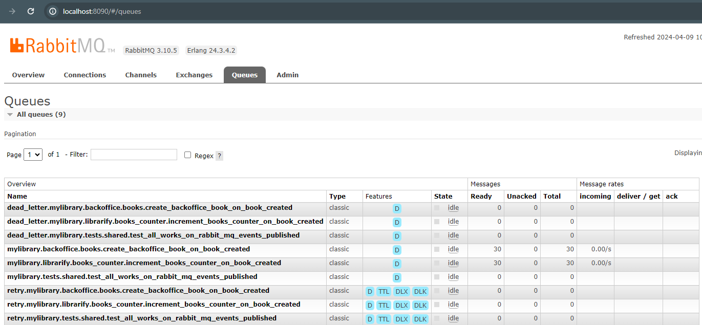

<h1 align="center">
  🐘🎯 Hexagonal Architecture, DDD & CQRS in PHP
</h1>

<p align="center">
  Librarify is a <strong>PHP application using Domain-Driven Design (DDD) and Command Query Responsibility Segregation
  (CQRS) principles</strong> keeping the code as simple as possible.
</p>

## 🚀 Environment Setup

### 🐳 Needed tools

1. [Install Docker](https://www.docker.com/get-started)
2. Clone this project: `git clone https://github.com/serodas/librarify-php-ddd.git`
3. Move to the project folder: `cd librarify-php-ddd`

### 🛠️ Environment configuration

1. Create a local environment file (`cp .env .env.local`) if you want to modify any parameter

### 🔥 Application execution

1. Install all the dependencies and bring up the project with Docker executing: `make build`
2. Then you'll have 2 apps available (2 APIs):
   1. [Librarify Backend](apps/librarify/backend): http://localhost:8030/health-check
   2. [Backoffice Backend](apps/backoffice/backend): http://localhost:8040/health-check

```
Note: If you are using Rest Client extension in VSCode, you can use the provided requests in the etc/endpoints
folder to test the API endpoints.
```

### ✅ Tests execution

1. Install the dependencies if you haven't done it previously: `make deps`
2. Execute PHPUnit and Behat tests: `make test`

## 👩‍💻 Project explanation

This project tries to be a library platform. It's decoupled from any framework, but it has
some Symfony implementation.

### ⛱️ Bounded Contexts

* [Librarify](src/Librarify): Place to look in if you wanna see some code 🙂. Library platform with books, authors, categories, and so on.

* [Backoffice](src/Backoffice): Here you will find a projection of books stored in Elasticsearch.

### 🎯 Hexagonal Architecture

This repository follows the Hexagonal Architecture pattern. Also, it's structured using `modules`.
With this, we can see that the current structure of a Bounded Context is:

```scala
$ tree -L 4 src

src
|-- Librarify // Company subdomain / Bounded Context: Features related to one of the company business lines / products
|   `-- Books // Some Module inside the Librarify context
|       |-- Application
|       |   |-- Create // Inside the application layer all is structured by actions
|       |   |   |-- BookCreator.php
|       |   |   |-- CreateBookCommand.php
|       |   |   `-- CreateBookCommandHandler.php
|       |   `-- Find
|       |-- Domain
|       |   |-- Book.php // The Aggregate of the Module
|       |   |-- BookCreatedDomainEvent.php // A Domain Event
|       |   |-- BookDescription.php
|       |   |-- BookNotFound.php
|       |   |-- BookRepository.php // The `Interface` of the repository is inside Domain
|       |   |-- BookScore.php
|       |   `-- BookTitle.php
|       `-- Infrastructure // The infrastructure of our module
|           |-- DependencyInjection
|           `-- Persistence
|               `--DoctrineBookRepository.php // An implementation of the repository
`-- Shared // Shared Kernel: Common infrastructure and domain shared between the different Bounded Contexts
    |-- Domain
    `-- Infrastructure
```

#### Repository pattern
Our repositories try to be as simple as possible usually only containing 2 methods `search` and `save`.
If we need some query with more filters we use the `Specification` pattern also known as `Criteria` pattern. So we add a
`searchByCriteria` method.

### Command Bus
There is 1 implementations of the [command bus](src/Shared/Domain/Bus/Command/CommandBus.php).
1. [Sync](src/Shared/Infrastructure/Bus/Command/InMemorySymfonyCommandBus.php) using the Symfony Message Bus

### Query Bus
The [Query Bus](src/Shared/Infrastructure/Bus/Query/InMemorySymfonyQueryBus.php) uses the Symfony Message Bus.

### Event Bus
The [Event Bus](src/Shared/Infrastructure/Bus/Event/InMemory/InMemorySymfonyEventBus.php) uses the Symfony Message Bus.
The [MySql Bus](src/Shared/Infrastructure/Bus/Event/MySql/MySqlDoctrineEventBus.php) uses a MySql+Pulling as a bus.
The [RabbitMQ Bus](src/Shared/Infrastructure/Bus/Event/RabbitMq/RabbitMqEventBus.php) uses RabbitMQ C extension.

- Rabbit Management: `:8090`


### Reference
Based on course DDD in PHP by [CodelyTV](https://codely.com/)